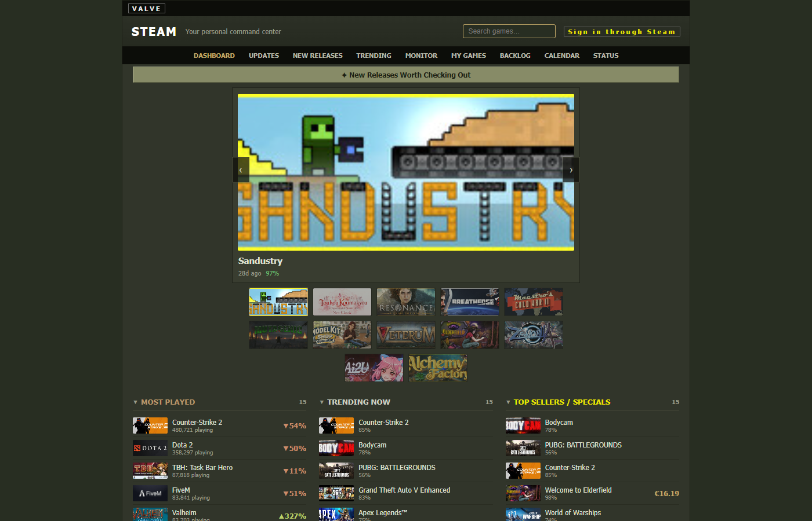

# Steam Command Center

A personal daily dashboard for Steam: new releases worth checking out, live trending and most-played counts, and a classified "what just got updated" feed scoped to your own owned and wishlisted games, styled after early-2003-era Steam.

[](https://github.com/314159DD/steam-command-center/actions/workflows/test.yml)
[](LICENSE)




---

## How it works

```
Steam store / search / news / players ─┐
IGDB (via Twitch OAuth) ────────────────┼─►  Python collector  ─►  Neon Postgres  ─►  Next.js dashboard
IsThereAnyDeal (prices, critic scores) ─┤    (cron, ~every 30m)     (snapshot store)   (reads Postgres only)
ProtonDB / Steam Deck compat ───────────┘
```

The frontend never calls Steam or any third party live on page load. A scheduled collector pulls each source, normalizes it, and writes snapshots into Postgres; the Next.js app only ever reads from the database, so every page is fast and immune to upstream rate limits.

## Features

| Section | What it shows |
|---|---|
| Dashboard | New-releases spotlight, most-played / trending / top-sellers discovery strips, a "worth your attention today" digest, and price-drop alerts for your wishlist |
| Updates | Classified patch feed (MAJOR / UPDATE / HOTFIX / CONTENT) for your owned and wishlisted games, with cleaned patch-note text |
| New Releases | Recent releases ranked by a quality + taste filter, two-tier (proven-good, then promising) so shovelware doesn't drown the good stuff |
| Trending | Live player-count momentum on the biggest games right now |
| Monitor | A live player-count rail for tracked games |
| My Games | Your owned + wishlisted library, sortable by hours played, completion, Steam Deck tier, review score, or price |
| Backlog | Owned, barely-played, Deck-ready games ranked by review quality, for "what should I actually play" |
| Calendar | Upcoming releases from your wishlist, dated where Steam provides a date |
| Game detail | Price + all-time low, review trend, Deck/ProtonDB compatibility, critic scores, achievement progress, and full patch history for one game |
| Search | Look up any tracked game by name |
| Status | Collector health: per-source last success/failure, so a broken upstream is visible instead of silent |

Personalization (owned games, wishlist, achievements) requires signing in with Steam (OpenID) and importing your library, which needs your Steam profile and game details set to Public - Steam's API has no way to read a private profile's data.

### PICS build watcher (optional, off by default)

`collector/pics_worker.py` is a separate, standalone script that watches Steam's PICS changelog for build-id changes using a logged-in Steam account (`steam[client]`). It is not imported or started by the main collector (`steam_collector.run`, the process the cron workflow and `Procfile` run) - it only runs if you start it explicitly and give it `STEAM_WATCHER_USERNAME`. Use a dedicated, throwaway Steam account, never your main one. See the docstrings in `collector/pics_worker.py` and `collector/enroll_authenticator.py` for setup.

## Quick start

### Database

Provision a Postgres database (Neon or any Postgres works) and run the migrations in order:

```bash
for f in db/migrations/*.sql; do psql "$DATABASE_URL" -f "$f"; done
```

### Collector

```bash
cd collector
python -m venv .venv && source .venv/bin/activate
pip install -e ".[dev]"
cp .env.example .env   # fill in STEAM_API_KEY, DATABASE_URL, at minimum
python -m steam_collector.run       # loops every COLLECT_INTERVAL_SECONDS
RUN_ONCE=1 python -m steam_collector.run   # single cycle, then exit
```

### Web

```bash
cd web
npm install
cp .env.local.example .env.local   # fill in DATABASE_URL, STEAM_API_KEY, SESSION_SECRET
npm run dev   # http://localhost:3000
```

## Configuration

### `collector/.env`

| Variable | Required | Purpose |
|---|---|---|
| `STEAM_API_KEY` | Yes | Steam Web API access |
| `DATABASE_URL` | Yes | Postgres connection string |
| `COLLECT_INTERVAL_SECONDS` | No | Loop interval in seconds (default `1800`); ignored when `RUN_ONCE=1` |
| `ITAD_API_KEY` | No | Prices, all-time-low, critic scores via IsThereAnyDeal |
| `TWITCH_CLIENT_ID`, `TWITCH_CLIENT_SECRET` | No | IGDB lookups via Twitch's client-credentials OAuth |

### `web/.env.local`

| Variable | Required | Purpose |
|---|---|---|
| `DATABASE_URL` | Yes | Postgres connection string (read-only from the app's perspective) |
| `STEAM_API_KEY` | Yes | Steam Web API access (achievements, owned games) |
| `SESSION_SECRET` | Yes | Signs the session cookie (any long random string) |
| `APP_BASE_URL` | Yes | Deployed origin; Steam OpenID's `return_to`/`realm` derive from it |

## Testing

99 collector tests (pytest) and 140 web tests (Vitest).

```bash
cd collector && pytest -q
cd web && npm test -- --run
```

CI (`.github/workflows/test.yml`) runs both suites plus a production `next build` on every push and pull request to `main`.

## Deploy

- **Web → Vercel**: import `web/` as the project root; set `DATABASE_URL`, `STEAM_API_KEY`, `SESSION_SECRET`, `APP_BASE_URL` (the production URL) as environment variables.
- **Collector → GitHub Actions cron** (`.github/workflows/collector.yml`, every 30 minutes + manual `workflow_dispatch`): set repo secrets `DATABASE_URL`, `STEAM_API_KEY`, and optionally `ITAD_API_KEY`, `TWITCH_CLIENT_ID`, `TWITCH_CLIENT_SECRET`. Scheduled workflows only run from the default branch.
- **Database**: any Postgres works; the project was built and run against Neon.

A running instance is live at [steam-hub-flax.vercel.app](https://steam-hub-flax.vercel.app).

## Project structure

```
collector/      Python worker: Steam store/news/players/PICS, IGDB, ITAD, ProtonDB clients
                 and the writer that upserts snapshots into Postgres
db/migrations/   Plain-SQL Postgres migrations, applied in order
web/             Next.js 16 app: Steam OpenID login, library import, dashboard pages
docs/design/     Design specs for major features
plan/            Roadmap and build log
```

## License

MIT. See [LICENSE](LICENSE).
